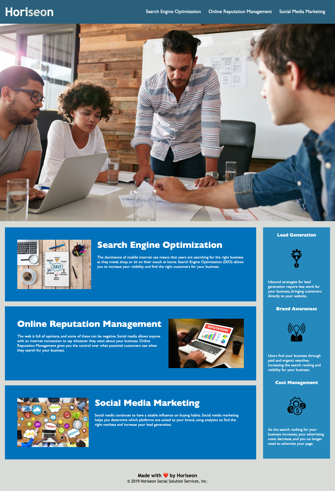

# horiseon-accessibility-refactor

## Description

This page is a refactoring of a Marketing Agency website in order to improve web accessiblity. Web accessibility helps people with disabilities to access websites using assistive technologies and is an increasingly important consideration for this project. The final product will improve accessibility for people using screen readers by including descriptive title and alt attributes and using semantic html elements that follow a logical order. 

### What I learned
I learned where and when to use different semantic elements and how to write desciptive alt attributes. Through this process I also learned to consolidate css elements in order to more concise code.

## Usage

The website can be found at [this link](https://carol-tsai.github.io/horiseon-accessibility-refactor/).

You can navigate to different sections of this page using the links on the top right corner. People using a screen reader will be able to hear a descriptive title and alt attributes for the images and icons on the website.

## Credits

Assets and original code acquired through UPenn LPS Coding Bootcamp course material.

### Reference documents
[HTML Semantic Elements](https://www.w3schools.com/html/html5_semantic_elements.asp)

## How to Contribute
Please reach out to me at carol.tsai0224@gmail.com if you would like to contribute to this project.

## License

MIT License

Copyright (c) 2022 Carol Tsai

Permission is hereby granted, free of charge, to any person obtaining a copy
of this software and associated documentation files (the "Software"), to deal
in the Software without restriction, including without limitation the rights
to use, copy, modify, merge, publish, distribute, sublicense, and/or sell
copies of the Software, and to permit persons to whom the Software is
furnished to do so, subject to the following conditions:

The above copyright notice and this permission notice shall be included in all
copies or substantial portions of the Software.

THE SOFTWARE IS PROVIDED "AS IS", WITHOUT WARRANTY OF ANY KIND, EXPRESS OR
IMPLIED, INCLUDING BUT NOT LIMITED TO THE WARRANTIES OF MERCHANTABILITY,
FITNESS FOR A PARTICULAR PURPOSE AND NONINFRINGEMENT. IN NO EVENT SHALL THE
AUTHORS OR COPYRIGHT HOLDERS BE LIABLE FOR ANY CLAIM, DAMAGES OR OTHER
LIABILITY, WHETHER IN AN ACTION OF CONTRACT, TORT OR OTHERWISE, ARISING FROM,
OUT OF OR IN CONNECTION WITH THE SOFTWARE OR THE USE OR OTHER DEALINGS IN THE
SOFTWARE.
